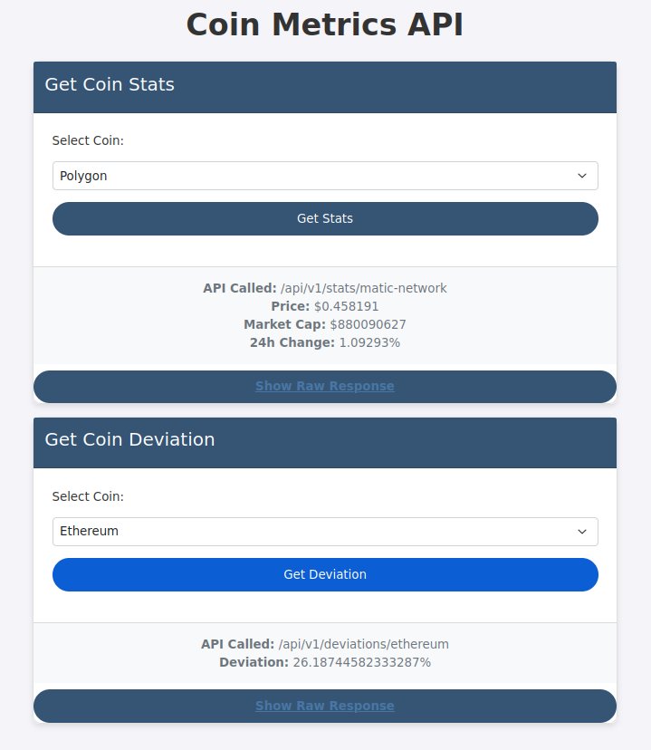
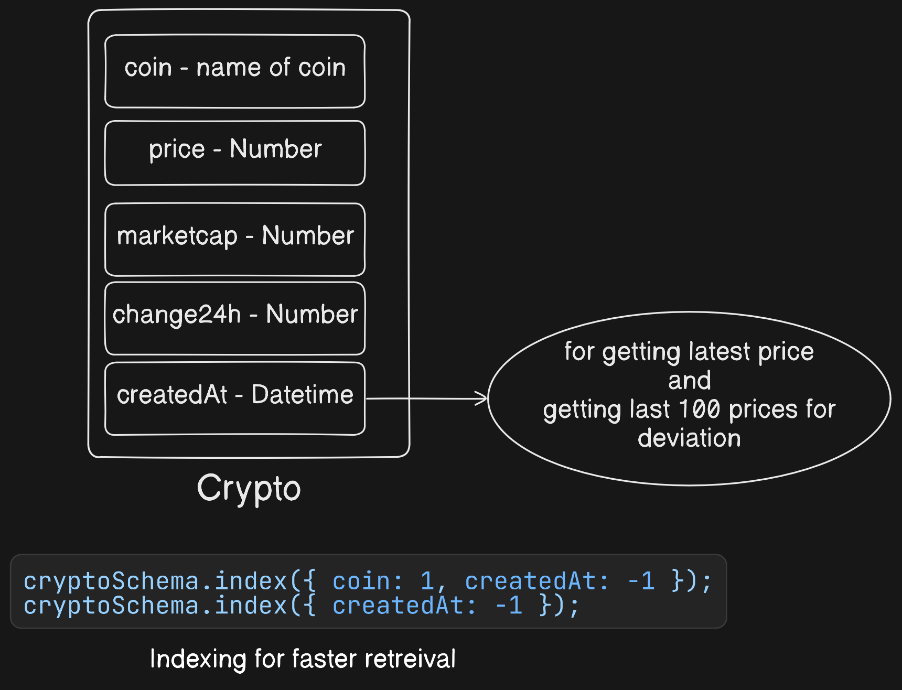
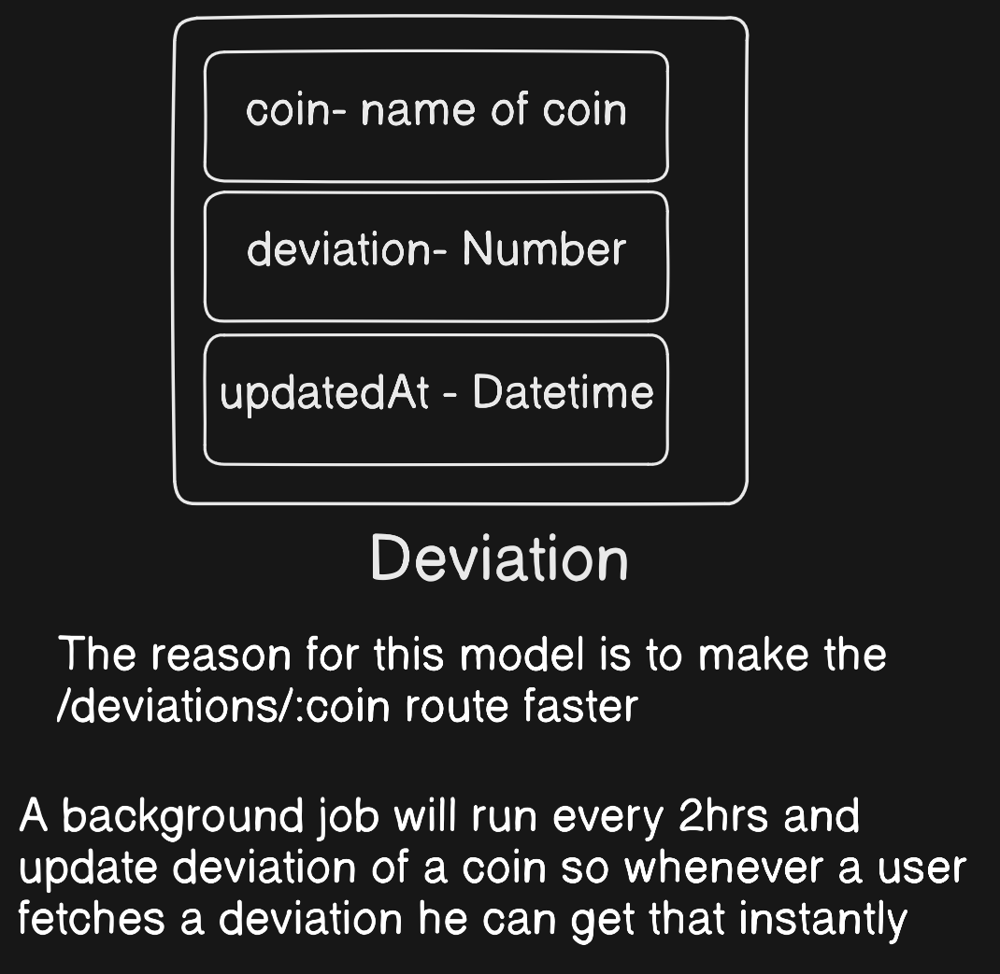

# coin-metrics

Track cryptocurrency data and provides statistical insights.

*Visit Hosted Site* https://tinyurl.com/coin-metrics-thesujai



# How It Works

1. **Crypto Data:** The app fetches real-time coin data (price, market cap, 24h change) and stores it in a MongoDB database.
    
2. **Deviation:** The app calculates the deviation of a coin's price and stores it in the database.

# Schema
1. **Crypto**


<br/>

2. **Deviation**


# Jobs

1. **Update Coin Info:** Runs every 2 hours to fetch and store fresh data from **coingecko**

2. **Update Deviation:** Periodically calculates and updates the deviation.<br/> **Why?** <br/> Calculating the deviation for each request can be computationally expensive, especially if it's done in real-time. By updating it periodically, we offload the heavy calculation from each user request and ensure that the system performs efficiently while still providing accurate data when needed.
3. **Delete Old Data:** Cleans up old crypto data every 7 days. <br/> **Why?** <br/> We don't need to retain old data beyond a certain point. Deleting data older than 5 days ensures that the database remains manageable and efficient. Since we fetch data at least twice a day, deleting data that’s 7 days old guarantees we still have enough recent entries (around 100 data points per crypto) to calculate the deviation effectively without overloading the database with outdated information.

Running the App

1. Clone the repo:
```
git clone https://github.com/your-github-username/coin-metrics.git
cd coin-metrics
```

2. Install dependencies:

```
yarn install
```

3. Set up the .env file with your MongoDB URI:

```
MONGO_URI=your-mongodb-connection-string
PORT=3000
```

4. Run the app:

```
yarn start
```

5. Open your browser and go to `http://localhost:3000` to view the app.


# APIs

1. **Get Coin Stats:** /api/v1/stats/:coin 
2. **Get Coin Deviation:** /api/v1/deviation/:coin

License

MIT License – see the [LICENSE]("https://github.com/thesujai/coin-metrics/blob/mainLICENSE") file.